# Borghi in diorama

Thirty pixel-art villages you can walk around in the browser. There is no 3D model anywhere: every
house, tree and lamp post is a flat sprite, and each of its pixels is given a depth.

**Play them at [martindavinci.github.io/mdv-demo-diorama](https://martindavinci.github.io/mdv-demo-diorama/)**

## The villages

<table>
<tr>
<td width="50%" valign="top"><a href="https://martindavinci.github.io/mdv-demo-diorama/villages/borgo-duepixel.html">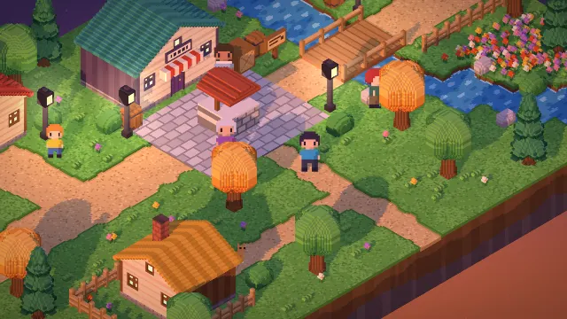</a> <b><a href="https://martindavinci.github.io/mdv-demo-diorama/villages/borgo-duepixel.html">Borgo Duepixel</a></b> — sunset. Three coloured houses, a shop and a well. Placeholder sprites drawn by code.</td>
<td width="50%" valign="top"><a href="https://martindavinci.github.io/mdv-demo-diorama/villages/borgo-delle-lanterne.html">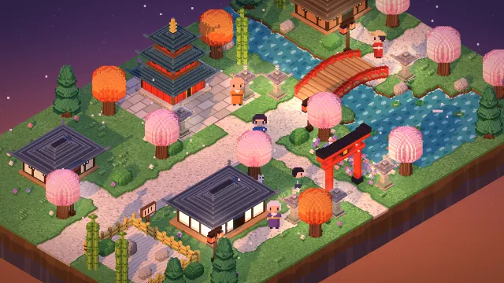</a> <b><a href="https://martindavinci.github.io/mdv-demo-diorama/villages/borgo-delle-lanterne.html">Borgo delle Lanterne</a></b> — sunset. A pagoda, a tea house and a red gate, with stone lanterns along the street.</td>
</tr>
<tr>
<td width="50%" valign="top"><a href="https://martindavinci.github.io/mdv-demo-diorama/villages/borgo-delle-dune.html">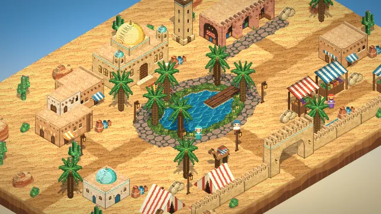</a> <b><a href="https://martindavinci.github.io/mdv-demo-diorama/villages/borgo-delle-dune.html">Borgo delle Dune</a></b> — day. A bazaar, a watchtower, a camel and a jetty.</td>
<td width="50%" valign="top"><a href="https://martindavinci.github.io/mdv-demo-diorama/villages/ravenbrook.html">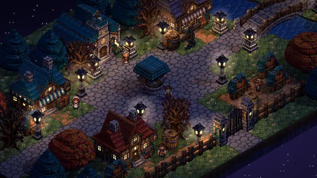</a> <b><a href="https://martindavinci.github.io/mdv-demo-diorama/villages/ravenbrook.html">Ravenbrook</a></b> — night. A church, an inn and a bakery, built from three image-model sprite sheets snapped back to a true pixel grid.</td>
</tr>
<tr>
<td width="50%" valign="top"><a href="https://martindavinci.github.io/mdv-demo-diorama/villages/borgo-di-leonardo.html">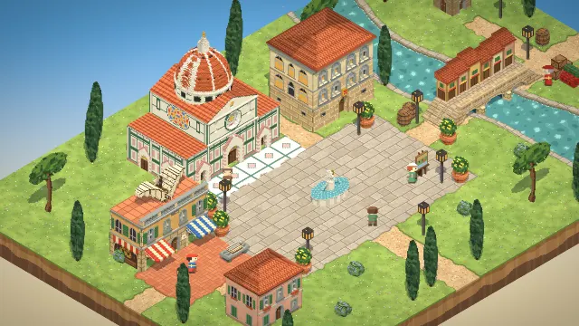</a> <b><a href="https://martindavinci.github.io/mdv-demo-diorama/villages/borgo-di-leonardo.html">Borgo di Leonardo</a></b> — day. A ribbed cathedral dome, Leonardo's workshop with the flying machine on its terrace, and a covered bridge lined with shops.</td>
<td width="50%" valign="top"><a href="https://martindavinci.github.io/mdv-demo-diorama/villages/borgo-dei-trulli.html">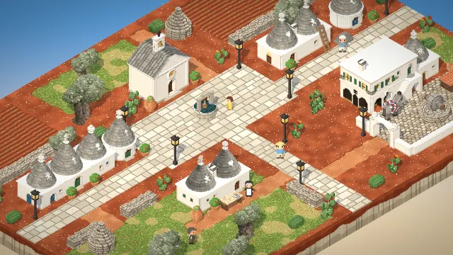</a> <b><a href="https://martindavinci.github.io/mdv-demo-diorama/villages/borgo-dei-trulli.html">Borgo dei Trulli</a></b> — day. Whitewashed trulli with painted cones, a little church, a masseria and an old olive grove.</td>
</tr>
<tr>
<td width="50%" valign="top"><a href="https://martindavinci.github.io/mdv-demo-diorama/villages/borgo-di-mare.html">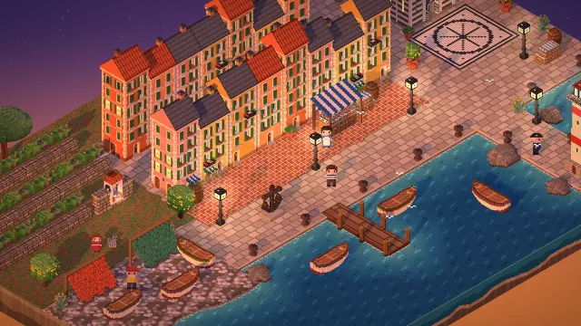</a> <b><a href="https://martindavinci.github.io/mdv-demo-diorama/villages/borgo-di-mare.html">Borgo di Mare</a></b> — sunset. Tall narrow coloured houses, a lighthouse on the breakwater, boats on the beach and nets drying.</td>
<td width="50%" valign="top"><a href="https://martindavinci.github.io/mdv-demo-diorama/villages/borgo-della-laguna.html">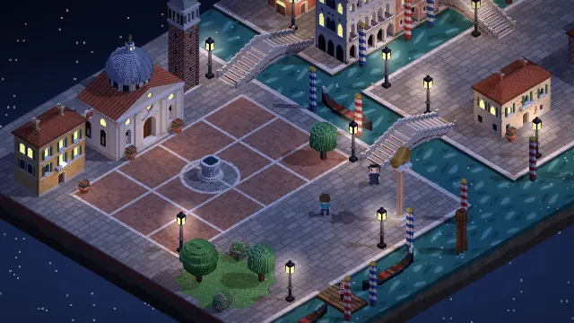</a> <b><a href="https://martindavinci.github.io/mdv-demo-diorama/villages/borgo-della-laguna.html">Borgo della Laguna</a></b> — night. Canals, stepped bridges, a Gothic palazzo with an arcade on the water, a campanile and gondolas.</td>
</tr>
<tr>
<td width="50%" valign="top"><a href="https://martindavinci.github.io/mdv-demo-diorama/villages/borgo-delle-nevi.html">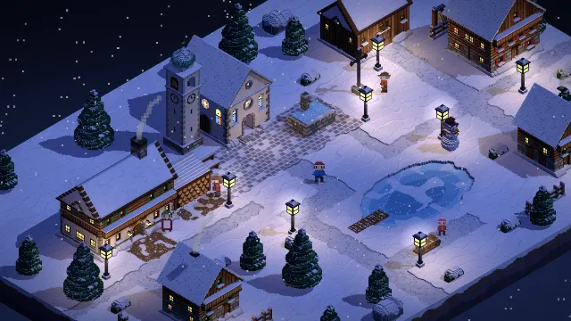</a> <b><a href="https://martindavinci.github.io/mdv-demo-diorama/villages/borgo-delle-nevi.html">Borgo delle Nevi</a></b> — night. An onion-domed bell tower, an inn, chalets under snow and a frozen pond.</td>
<td width="50%" valign="top"><a href="https://martindavinci.github.io/mdv-demo-diorama/villages/borgo-del-castello.html">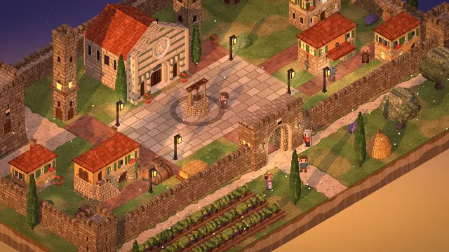</a> <b><a href="https://martindavinci.github.io/mdv-demo-diorama/villages/borgo-del-castello.html">Borgo del Castello</a></b> — sunset. A keep, a church with a rose window and three tall towers inside battlemented walls, vineyards outside.</td>
</tr>
<tr>
<td width="50%" valign="top"><a href="https://martindavinci.github.io/mdv-demo-diorama/villages/borgo-delle-rovine.html">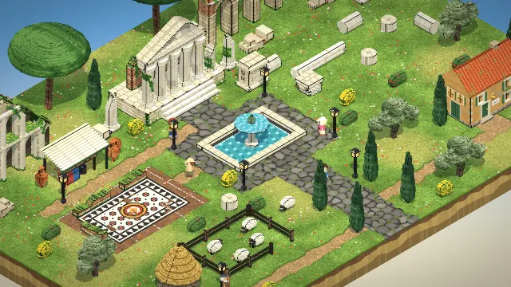</a> <b><a href="https://martindavinci.github.io/mdv-demo-diorama/villages/borgo-delle-rovine.html">Borgo delle Rovine</a></b> — day. A six-column temple, a broken aqueduct, half an amphitheatre and a mosaic in the dig.</td>
<td width="50%" valign="top"><a href="https://martindavinci.github.io/mdv-demo-diorama/villages/borgo-dei-funghi.html">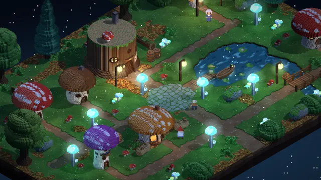</a> <b><a href="https://martindavinci.github.io/mdv-demo-diorama/villages/borgo-dei-funghi.html">Borgo dei Funghi</a></b> — night. Mushroom houses, a tavern in a tree stump and glowing mushrooms around a pond.</td>
</tr>
<tr>
<td width="50%" valign="top"><a href="https://martindavinci.github.io/mdv-demo-diorama/villages/borgo-dei-mulini.html">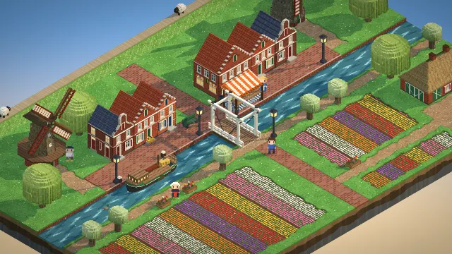</a> <b><a href="https://martindavinci.github.io/mdv-demo-diorama/villages/borgo-dei-mulini.html">Borgo dei Mulini</a></b> — dawn. Two windmills, stepped-gable houses along a canal, a white drawbridge and tulip fields.</td>
<td width="50%" valign="top"><a href="https://martindavinci.github.io/mdv-demo-diorama/villages/borgo-del-faro.html">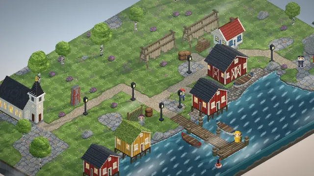</a> <b><a href="https://martindavinci.github.io/mdv-demo-diorama/villages/borgo-del-faro.html">Borgo del Faro</a></b> — misty dawn. Fishing huts on stilts, a striped lighthouse and cod drying on racks.</td>
</tr>
<tr>
<td width="50%" valign="top"><a href="https://martindavinci.github.io/mdv-demo-diorama/villages/borgo-della-miniera.html">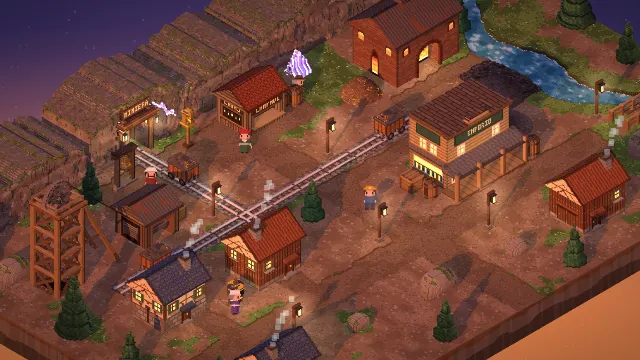</a> <b><a href="https://martindavinci.github.io/mdv-demo-diorama/villages/borgo-della-miniera.html">Borgo della Miniera</a></b> — sunset. A mine cut into the rock, a headframe over the shaft, ore carts on rails and a smoking smelter.</td>
<td width="50%" valign="top"><a href="https://martindavinci.github.io/mdv-demo-diorama/villages/borgo-degli-igloo.html">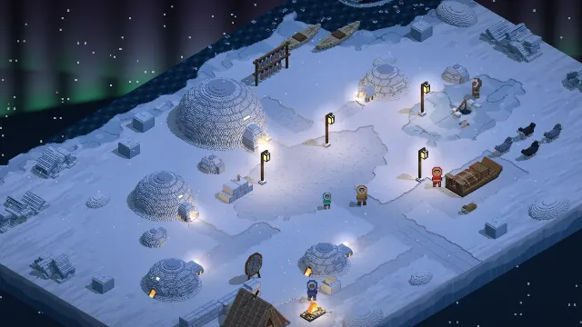</a> <b><a href="https://martindavinci.github.io/mdv-demo-diorama/villages/borgo-degli-igloo.html">Borgo degli Igloo</a></b> — night. A camp on the sea ice under the aurora: igloos, a hide tent, dogs and a sled.</td>
</tr>
<tr>
<td width="50%" valign="top"><a href="https://martindavinci.github.io/mdv-demo-diorama/villages/borgo-dei-sassi.html">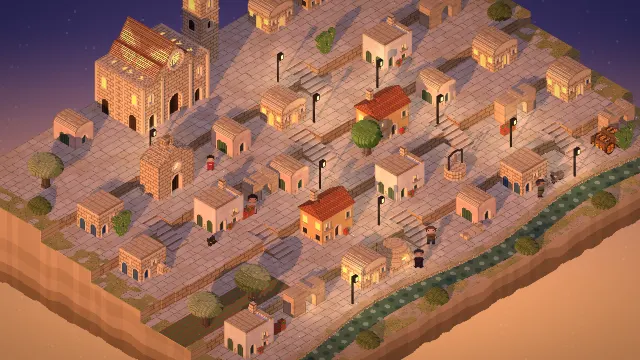</a> <b><a href="https://martindavinci.github.io/mdv-demo-diorama/villages/borgo-dei-sassi.html">Borgo dei Sassi</a></b> — sunset. Tuff houses and cave dwellings on five terraces linked by stairs, a rock-cut church and the cathedral on top, above the ravine.</td>
<td width="50%" valign="top"><a href="https://martindavinci.github.io/mdv-demo-diorama/villages/borgo-bianco.html">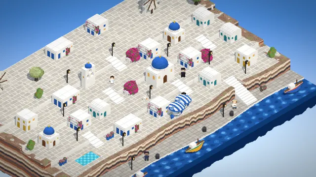</a> <b><a href="https://martindavinci.github.io/mdv-demo-diorama/villages/borgo-bianco.html">Borgo Bianco</a></b> — day. Whitewashed cubes and blue domes on a layered volcanic cliff, windmills on top, a small harbour below.</td>
</tr>
<tr>
<td width="50%" valign="top"><a href="https://martindavinci.github.io/mdv-demo-diorama/villages/borgo-di-fango.html">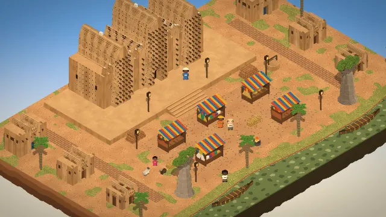</a> <b><a href="https://martindavinci.github.io/mdv-demo-diorama/villages/borgo-di-fango.html">Borgo di Fango</a></b> — day. A mud-brick mosque bristling with palm beams, a market under cloth awnings, baobabs and pirogues on the river.</td>
<td width="50%" valign="top"><a href="https://martindavinci.github.io/mdv-demo-diorama/villages/isola-nel-cielo.html">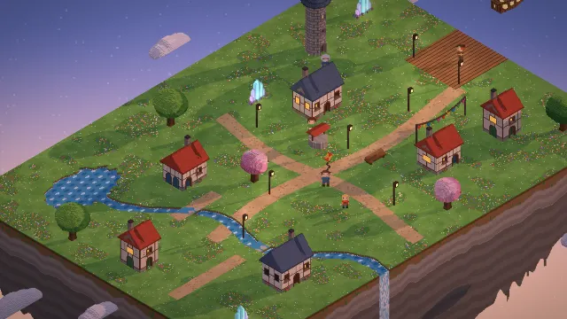</a> <b><a href="https://martindavinci.github.io/mdv-demo-diorama/villages/isola-nel-cielo.html">Isola nel Cielo</a></b> — dawn. A floating island: cottages, a wind tower, glowing crystals, a stream that pours off the edge and an airship at the dock.</td>
</tr>
<tr>
<td width="50%" valign="top"><a href="https://martindavinci.github.io/mdv-demo-diorama/villages/covo-dei-pirati.html">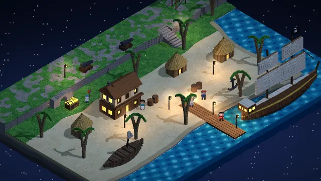</a> <b><a href="https://martindavinci.github.io/mdv-demo-diorama/villages/covo-dei-pirati.html">Covo dei Pirati</a></b> — night. A sandy cove with a tavern, a ship at the jetty, a wreck, a campfire and a treasure under the cliff.</td>
<td width="50%" valign="top"><a href="https://martindavinci.github.io/mdv-demo-diorama/villages/base-su-marte.html">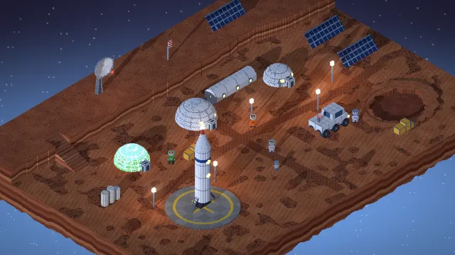</a> <b><a href="https://martindavinci.github.io/mdv-demo-diorama/villages/base-su-marte.html">Base su Marte</a></b> — blue sunset. Habitat domes, a greenhouse, a rocket on its pad and a crater in the red dust.</td>
</tr>
<tr>
<td width="50%" valign="top"><a href="https://martindavinci.github.io/mdv-demo-diorama/villages/borgo-degli-gnomi.html">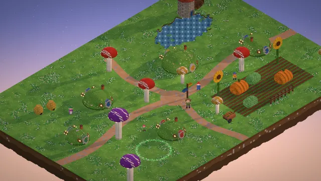</a> <b><a href="https://martindavinci.github.io/mdv-demo-diorama/villages/borgo-degli-gnomi.html">Borgo degli Gnomi</a></b> — dawn. Hillock houses with round doors, toadstool lamps, giant pumpkins, a water mill and a fairy ring that glows at night.</td>
<td width="50%" valign="top"><a href="https://martindavinci.github.io/mdv-demo-diorama/villages/citta-dei-maghi.html">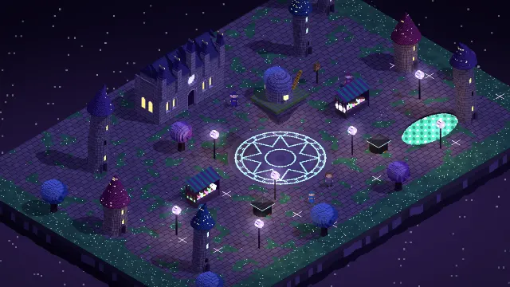</a> <b><a href="https://martindavinci.github.io/mdv-demo-diorama/villages/citta-dei-maghi.html">Città dei Maghi</a></b> — night. Crooked starry-roofed towers, an academy, an observatory floating over the square and a glowing magic circle.</td>
</tr>
<tr>
<td width="50%" valign="top"><a href="https://martindavinci.github.io/mdv-demo-diorama/villages/borgo-sull-albero.html">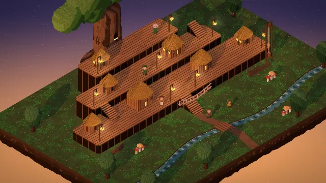</a> <b><a href="https://martindavinci.github.io/mdv-demo-diorama/villages/borgo-sull-albero.html">Borgo sull’Albero</a></b> — sunset. Huts on three plank decks around a giant tree, stairs, hanging lanterns and a stream in the undergrowth.</td>
<td width="50%" valign="top"><a href="https://martindavinci.github.io/mdv-demo-diorama/villages/rocca-del-drago.html">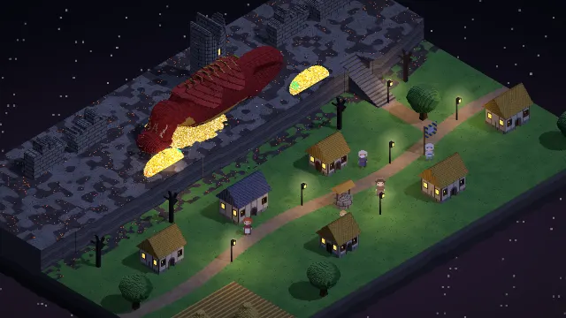</a> <b><a href="https://martindavinci.github.io/mdv-demo-diorama/villages/rocca-del-drago.html">Rocca del Drago</a></b> — night. A dragon asleep around the tower of a ruined castle, glowing gold, and a village with lit windows below the cliff.</td>
</tr>
<tr>
<td width="50%" valign="top"><a href="https://martindavinci.github.io/mdv-demo-diorama/villages/villaggio-dei-ghiacci.html">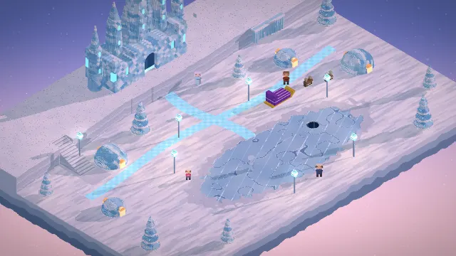</a> <b><a href="https://martindavinci.github.io/mdv-demo-diorama/villages/villaggio-dei-ghiacci.html">Villaggio dei Ghiacci Eterni</a></b> — dawn. A crystal palace, ice-dome houses, crystal trees, reindeer and a frozen lake with a skating spirit.</td>
<td width="50%" valign="top"><a href="https://martindavinci.github.io/mdv-demo-diorama/villages/porto-delle-fate.html">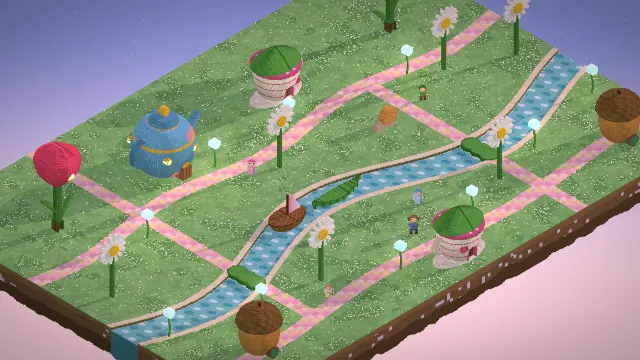</a> <b><a href="https://martindavinci.github.io/mdv-demo-diorama/villages/porto-delle-fate.html">Porto delle Fate</a></b> — dawn. Houses in a teapot, a cup, a tulip and an acorn, lily pads across the river, leaf and walnut boats.</td>
</tr>
<tr>
<td width="50%" valign="top"><a href="https://martindavinci.github.io/mdv-demo-diorama/villages/mercato-dei-golem.html">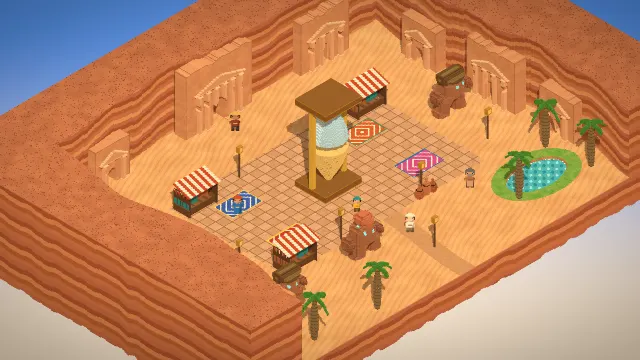</a> <b><a href="https://martindavinci.github.io/mdv-demo-diorama/villages/mercato-dei-golem.html">Mercato dei Golem</a></b> — day. A sandstone canyon with carved houses, a giant hourglass, market rugs and clay golems carrying loads.</td>
<td width="50%" valign="top"><a href="https://martindavinci.github.io/mdv-demo-diorama/villages/abbazia-dei-fantasmi.html">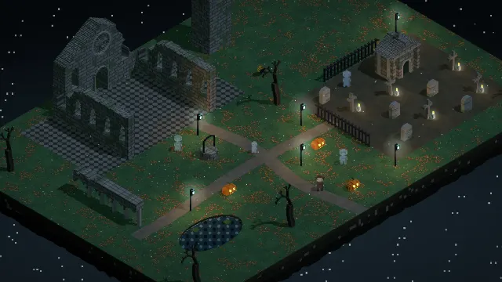</a> <b><a href="https://martindavinci.github.io/mdv-demo-diorama/villages/abbazia-dei-fantasmi.html">Abbazia dei Fantasmi</a></b> — night. A ruined abbey in the fog, a cemetery with grave candles and four friendly, see-through ghosts.</td>
</tr>
</table>

From Borgo di Leonardo on, every sprite and every ground tile is drawn by code at load.

For comparison, [the first build of Borgo Duepixel](https://martindavinci.github.io/mdv-demo-diorama/villages/borgo-duepixel-unoptimized.html)
uses live point lights for the lamps and a tilt-shift blur.

The interface and the dialogue are in Italian.

## Controls

| | Keyboard | Phone |
| --- | --- | --- |
| Walk | WASD or arrows | stick, bottom left |
| Talk, examine | Z | button, bottom right |
| Rotate the view | Q / E, or drag | drag |
| Time of day (dawn, day, sunset, night) | T | toolbar |
| Shadows | O | toolbar |
| Zoom | mouse wheel | |

## What you need

A browser with WebGL. Each village is one HTML page; once it has loaded it needs no network, and
nothing is loaded from outside this site.

## Credits

- [three.js](https://threejs.org) r128, MIT License — `vendor/three/`
- [Pixelify Sans](https://github.com/eifetx/Pixelify-Sans) and [DM Mono](https://github.com/googlefonts/dm-mono), SIL Open Font License 1.1 — `vendor/fonts/`

Everything else is under the MIT License in `LICENSE`.
